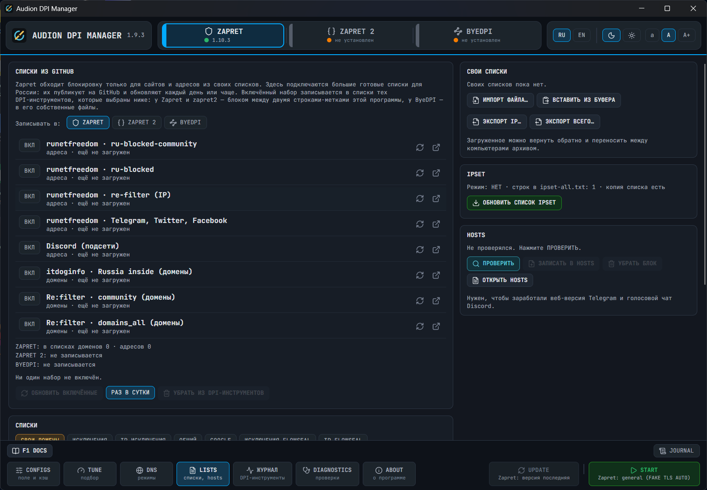

# Audion DPI Manager

<!-- audion:release -->

  
  
  
  

**Version 1.9.3** · 2026-09-29 · 49.3 MB

- [Direct download](https://audion.dev/get/dpi-manager/1.9.3/Audion_DPI_Manager_v1.9.3_Full.zip) — unmetered, no rate limits
- [Project page](https://audion.dev/downloads/dpi-manager) — every version and how to install

`SHA-256: a8fbafebee27cfc0aaab653932321bed4d517d7a32dc33b39b12fd6a6469e7ea`

---

An **Audion** tool, published by [Tensionix](https://github.com/Tensionix).
<!-- /audion:release -->

[English README](Docs/README_EN.md) · [User Guide](Docs/USER_GUIDE_EN.md) | [Русский README](Docs/README_RU.md) · [Руководство](Docs/USER_GUIDE_RU.md)

**Contents**

- [Why](#why)
- [How it is built](#how-it-is-built)
- [What is inside](#what-is-inside)
- [Starting](#starting)
- [What the program does not do](#what-the-program-does-not-do)
- [License](#license)

One window for the programs that get round traffic blocking: **Zapret** (Flowseal), **zapret2** (bol-van) and **ByeDPI** (romanvht). Install and update with one button, run a strategy, autostart as a service, parameter tuning, DNS modes, a cache of 200 configurations with pins and deletion.

## Why

Getting round blocking is not "download and run". You need a strategy that suits your provider; you need a secure DNS; you need to update the package without losing your lists; you need to find out why it does not work. All of that is here in one window, not in console menus and five folders.

## How it is built

- **On top** one row of three pieces: the name, in the middle three big switches — ZAPRET, ZAPRET 2, BYEDPI, on the right the language, the theme and the font. A switch is a full switch of the DPI tool: each has its own files, its own connection and its own meaning of the UPDATE and START buttons. The version and "is it working now" are shown on the buttons themselves.
- **At the bottom** the permanent tool buttons — CONFIGS, TUNE, DNS, LISTS, JOURNAL, DIAGNOSTICS, ABOUT — and on the right UPDATE | START. A button with nothing to do is gray.
- The window works with the same files, services and registry entries as Flowseal's bat files, so the `service.bat` menu and this window can be used alternately.

## What is inside

| Section | What it does |
|---|---|
| ZAPRET | Install and update Flowseal's package, run a strategy, the service, game and IPSet filters |
| ZAPRET 2 | Install, update and connect zapret2; the preset from its documentation in a field |
| BYEDPI | Install and update ByeDPI Manager, connect through the system proxy |
| CONFIGS | The configuration field and a cache of 200 entries (star - pin, cross - delete) |
| TUNE | Parameter tuning: READY, REPEATS, FOOLING, SPLIT, ALL |
| DNS | The modes GOOGLE, CLOUDFLARE, QUAD9, ADGUARD and OWN (servers and a DoH address in one line) with a check and an exact restore |
| LISTS | Ready lists for Russia from GitHub (runetfreedom, itdoginfo, re:filter; updated every day) for Zapret, zapret2 and ByeDPI, own lists, import and export, the IPSet list, the hosts file |
| DIAGNOSTICS | The reasons why the bypass does not work, as a table with fixes |

## Starting

Start `Start.exe`: Windows asks for administrator rights (without them the WinDivert driver cannot be loaded). Details are in the [user guide](Docs/USER_GUIDE_EN.md).

## What the program does not do

It collects and sends no data; it talks only to GitHub (versions, releases, lists) and, on your button, to the DNS servers you named yourself. It puts nothing into the Windows scheduler. It changes the system only by your buttons, every change goes to the journal, and DNS and the system proxy come back exactly.

Third-party programs (Flowseal, zapret2, ByeDPI Manager) are downloaded from GitHub by your button and lie in their own folders with their own licences.

## License

Audion DPI Manager is © 2026 Tensionix, under the [Apache License 2.0](../LICENSE) (see also [NOTICE](../NOTICE)). "Audion" and the Audion mark are trademarks of the author: the licence (section 6) grants no right to use them, and a copy or a changed version must not be presented as Audion.
